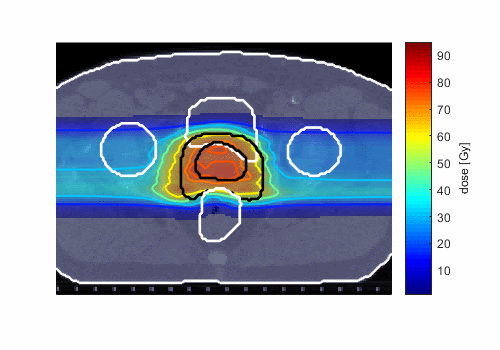
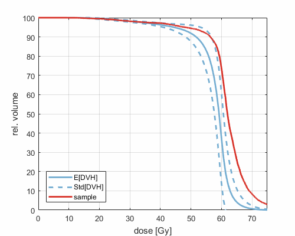
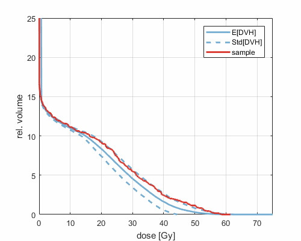

## ESTRO 37 - Animations from the ePoster "Smooth animations of the probabilistic analog to worst case dose distribution"

N. Wahl, P. Hennig, H.-P. Wieser, M. Bangert

### Non-robust paraspinal plan vs. robust plan

paraspinal case, non-robust plan, 5 fractions

paraspinal case, robust plan, 5 fractions

### Non-robust prostate plan under fractionation

prostate plan, single fraction

prostate plan, 30 fractions

### paraspinal plan, DVH animations

CTV:

spinal cord:

### Other examples (from Abstract)

